# AI / LLM Threat Landscape 2026

> **As of 2026-09-30.** This document is a cyber threat-intelligence synthesis focused on AI, LLM, GenAI and agentic systems. Metrics keep the population and time window used by the original source. They are not silently generalized to the whole internet.

## Executive assessment

The defining 2026 shift is not that attackers suddenly discovered AI. It is that AI is moving deeper into the **execution path** of cyber operations while the AI stack itself becomes a first-class attack surface.

The landscape now has five interacting forces:

1. **AI-assisted operations are becoming AI-operated workflows.**
2. **Agentic systems turn model output into real-world capability.**
3. **Prompt injection is evolving from chat behavior into content-borne and workflow risk.**
4. **AI supply chains concentrate trust in packages, models, CI/CD, gateways and agent frameworks.**
5. **Enterprise AI adoption creates a parallel data/identity exposure problem even without an attacker.**

This is why LLMInjection tracks both **AI as attack infrastructure** and **AI as an asset under attack**.

---

## 2026 telemetry snapshot

| Signal | Verified value | Population / time window | Primary source |
|---|---:|---|---|
| Leaders expecting AI to be the biggest force shaping cyber in 2026 | **94%** | WEF survey respondents | World Economic Forum |
| Respondents identifying AI-related vulnerabilities as fastest-growing risk | **87%** | 2025 observations in WEF 2026 outlook | World Economic Forum |
| Average attacks per organization per week | **1,968** | 2025 | Check Point |
| AI-agent-triggered detection leads vs human-triggered growth | **2.5×** | parts of Q1 2026 | CrowdStrike |
| Cloud-conscious eCrime activity | **+171%** | CrowdStrike 2026 reporting period | CrowdStrike |
| Registry threats involving malicious npm packages | **87%** | 1H 2026 | CrowdStrike |
| PoC exploitation observed within 48h | **88%** | 1H 2026 | CrowdStrike |
| Confirmed ransomware victims | **7,831** | 2025 activity in Fortinet dataset | Fortinet |
| Ransomware victim increase | **+389% YoY** | Fortinet dataset | Fortinet |
| Ransomware-associated data theft | **896.2 TB** | Zscaler 2026 report period | Zscaler ThreatLabz |
| Blockchain transactions associated with ransomware payments | **US$328M** | Zscaler 2026 report period | Zscaler ThreatLabz |
| High-risk GenAI prompts | **2% → 4%** | one-year change | Check Point Research |
| Average AI apps used per organization/month | **10** | Check Point 2026 report | Check Point Research |
| Longer malicious prompt-injection payload detections | **~5×** | Mar-May 2026 | Check Point Research |
| Major supply-chain / third-party incidents since 2020 | **nearly 4×** | 2020-2025 | IBM X-Force |

Machine-readable version: [`data/threat-landscape-2026.json`](../data/threat-landscape-2026.json)

---

## Landscape map

```mermaid
flowchart TB
    L["AI / LLM Threat Landscape 2026"]

    L --> O["AI as Operator"]
    L --> E["AI as Offensive Enabler"]
    L --> T["AI as Target"]
    L --> X["Enterprise AI Exposure"]

    O --> O1["Agentic task chains"]
    O --> O2["Runtime LLM decisions"]
    O --> O3["Autonomous tool use"]

    E --> E1["Recon / OSINT"]
    E --> E2["Social engineering"]
    E --> E3["Malware / code acceleration"]
    E --> E4["Exploit iteration"]

    T --> T1["Prompt injection / promptware"]
    T --> T2["Agent / MCP / tool abuse"]
    T --> T3["RAG / memory poisoning"]
    T --> T4["Model integrity"]
    T --> T5["AI supply chain"]

    X --> X1["Shadow AI"]
    X --> X2["Sensitive-data prompts"]
    X --> X3["Cloud / identity abuse"]
    X --> X4["Gateway credential concentration"]
```



---

## 1. AI as active operator

The strongest change in 2026 is the appearance of public reporting where AI participates in **live execution** rather than just writing phishing text or code.

CrowdStrike reported that AI-agent-triggered detection leads grew at **2.5× the rate of human-triggered leads** in parts of Q1 2026. Anthropic's GTG-1002 reporting, already tracked in this repository, describes a campaign where AI performed most tactical operations. Cisco Talos' CLOSEDQUORUM analysis provides a malware design reference for autonomous decision-making, while explicitly noting that Talos had **not confirmed in-the-wild deployment**.

### Defensive consequence

The telemetry boundary moves from “what prompt was sent?” to:

```text
model / agent
   ↓
decision
   ↓
tool / API / command
   ↓
credential / identity
   ↓
side effect
```

High-value controls are therefore **tool authorization, workload identity, action-risk tiers, deterministic policy and auditability**.

Related tests: [TC-AG-005](TEST-CASES.md#tc-ag-005--unauthorized-tool-invocation), [TC-AG-006](TEST-CASES.md#tc-ag-006--high-impact-action-confirmation), [TC-AUTO-015](TEST-CASES.md#tc-auto-015--autonomous-multi-step-chain-gate).

---

## 2. AI as an offensive force multiplier

AI continues to lower time and labor requirements for reconnaissance, translation, code development, debugging and campaign adaptation.

Check Point Research's **VoidLink** case is useful because the evidence is not merely “the code looks AI-generated”: recovered development artifacts tied a roughly **88,000-line** functional malware framework to one developer using an AI coding environment in under a week.

This does **not** mean every sophisticated malware sample is AI-authored. It means AI-assisted development has crossed the threshold from toy output to operationally useful software.

### Intelligence implication

Traditional malware analysis should record AI-development evidence when present, but avoid unsupported attribution based on coding style alone.

---

## 3. Prompt injection becomes operational infrastructure risk

Prompt Injection remains **LLM01:2026** in the OWASP GenAI LLM Top 10. Check Point Research reported that detections of longer malicious payloads rose roughly **fivefold between March and May 2026**, approaching 1% of observed prompts in May. The vendor interprets those longer payloads as more typical of content-borne and agentic attack paths.

The crucial distinction:

- **Direct injection**: attacker controls the user prompt.
- **Indirect injection**: malicious instructions are embedded in content the system retrieves or reads.
- **Agentic consequence**: injected content can influence tools, identity, memory or downstream actions.

The defensive objective is therefore not “make the model impossible to fool”. It is **limit what a fooled model can cause**.

Related tests: [TC-PI-001](TEST-CASES.md#tc-pi-001--direct-prompt-injection-boundary), [TC-PI-002](TEST-CASES.md#tc-pi-002--indirect-prompt-injection-in-rag), [TC-OH-013](TEST-CASES.md#tc-oh-013--improper-output-handling).

---

## 4. Promptware: useful emerging research model

The January 2026 paper *The Promptware Kill Chain* proposed treating multi-stage LLM attacks as a malware-like lifecycle rather than reducing everything to “prompt injection”.

The concept is valuable for threat modeling because it links:

**initial access → privilege escalation → persistence → lateral movement → actions on objective**

Cloud Security Alliance subsequently published research extending the promptware framing into agent/C2 scenarios.

### Analytic caution

“Promptware” should be treated as an **emerging research construct**, not as proof that every prompt injection is malware or that every described stage has been observed in a single production incident.

Primary research: https://arxiv.org/abs/2601.09625

---

## 5. Agentic risk moves toward the center

OWASP published the **GenAI LLM Top 10 2026** in August 2026. The canonical list is:

| Rank | Risk |
|---:|---|
| LLM01 | Prompt Injection |
| LLM02 | Sensitive Information Disclosure |
| LLM03 | **Excessive Agency** |
| LLM04 | Supply Chain |
| LLM05 | Data and Model Poisoning |
| LLM06 | **Unbounded Consumption** |
| LLM07 | Misinformation |
| LLM08 | Hidden Context Exposure |
| LLM09 | Vector and Embedding Weaknesses |
| LLM10 | Improper Output Handling |

The 2026 release explicitly combines community judgment with real-world incident analysis. Excessive Agency moved from #6 to **#3**, while Unbounded Consumption moved from #10 to **#6**.

OWASP also maintains the separate **Top 10 for Agentic Applications 2026**:

`ASI01 Goal Hijack` · `ASI02 Tool Misuse` · `ASI03 Identity & Privilege Abuse` · `ASI04 Agentic Supply Chain` · `ASI05 Unexpected Code Execution` · `ASI06 Memory & Context Poisoning` · `ASI07 Insecure Inter-Agent Communication` · `ASI08 Cascading Failures` · `ASI09 Human-Agent Trust Exploitation` · `ASI10 Rogue Agents`.

This is the architectural shift that matters: **security moves from what a model can say to what a system can do**.

---

## 6. AI supply chain becomes a first-class target

The AI stack inherits the entire software supply chain and adds new artifact types:

- model weights;
- datasets;
- embedding/vector stores;
- agent frameworks;
- tool/MCP servers;
- model gateways;
- model registries/hubs;
- prompts/policies/configuration;
- fine-tuning adapters;
- CI/CD identities and release automation.

CrowdStrike reported that **87%** of identified software registry threats in 1H 2026 involved malicious npm packages. It also reported STARDUST CHOLLIMA injecting a malicious dependency into at least **131 Mastra AI framework packages**, while ALTERED SPIDER compromised more than 300 software dependencies in one day.

IBM X-Force reported that major supply-chain and third-party incidents had **nearly quadrupled since 2020**.

### Defensive direction

AI systems need **AIBOM/SBOM, model provenance, digest/signature verification, dependency policy, CI identity hardening and release-path monitoring**.

Related tests: [TC-SC-008](TEST-CASES.md#tc-sc-008--coding-agent-dependency-manipulation), [TC-SC-009](TEST-CASES.md#tc-sc-009--model-artifact-provenance-drift).

---

## 7. Enterprise AI exposure is its own threat landscape

Not all AI risk requires an attacker.

Check Point Research reported:

- high-risk GenAI prompts doubled from **2% to 4%** over a year;
- organizations used an average of **10 AI applications per month**;
- Business Services had the highest measured high-risk-prompt rate at **5.91%** from January-May 2026.

This creates a parallel landscape around **Shadow AI, unmanaged tenants, unsanctioned connectors, external model APIs and sensitive context sharing**.

The core defensive question becomes:

> Which AI service, tenant, model, connector or agent handled which data under which identity and policy?

---

## 8. Identity and cloud remain foundational

AI-specific controls do not replace ordinary identity security.

CrowdStrike reported **+171% cloud-conscious eCrime activity** and a **15× increase in monthly device-code phishing attempts** in 1H 2026. Fortinet reported that most confirmed cloud incidents in its 2025 dataset originated from stolen, exposed or misused credentials rather than infrastructure exploitation.

AI workloads intensify the problem because model gateways, coding agents and automation frequently hold **high-value service credentials**.

### Hunt priority

Correlate:

```text
AI process / agent identity
 + provider or gateway traffic
 + credential access
 + tool execution
 + unusual cloud action
```

---

## 9. Ransomware shifts further toward data extortion

Fortinet reported **7,831 confirmed ransomware victims** in its 2025 activity dataset, up 389% from the prior report. Zscaler reported **896.2 TB** of ransomware-associated data theft and **US$328 million** in blockchain transactions associated with ransomware payments.

Zscaler's findings reinforce a broader transition from encryption-only disruption toward **data theft, extortion and targeting of privileged employees**.

This is adjacent to AI rather than uniquely caused by it: AI is one acceleration factor inside a larger criminal economy.

---

## 10. Model safety is not a standalone system security boundary

Unit 42's 2026 perturbation-probing research on Qwen3-4B found that **50 of 350,208 feed-forward neurons** in the tested model were causally associated with the refusal template under their experiment.

That result should be interpreted narrowly: it is a finding about specific models, behaviors and tests, not proof that “all LLM safety lives in 50 neurons”.

The defensive lesson is sound anyway: **external policy, sandboxing, identity, provenance and tool authorization must exist outside the model**.

---

## Sector signals

Two datasets illustrate different sector exposures and must not be conflated.

### Fortinet ransomware victims

| Sector | Victims |
|---|---:|
| Manufacturing | **1,284** |
| Business Services | **824** |
| Retail | **682** |

### Check Point high-risk GenAI prompts, Jan-May 2026

| Sector | High-risk prompts |
|---|---:|
| Business Services | **5.91%** |
| Wholesale & Distribution | **5.47%** |
| Telecommunications | **4.06%** |
| Software | **3.52%** |
| Industrial Manufacturing | **3.07%** |
| Government | **3.01%** |
| Financial Services | **2.72%** |

These measure different things: one is ransomware victim reporting; the other is enterprise GenAI data-exposure telemetry.

---

## Notable cases: status matters

| Case | What it tells us | Status |
|---|---|---|
| GTG-1002 | AI-orchestrated intrusion workflow | Confirmed vendor reporting |
| APT28 / PROMPTSTEAL | Runtime LLM command generation | Confirmed vendor reporting |
| VoidLink | AI-accelerated malware engineering | Confirmed research |
| STARDUST CHOLLIMA / Mastra | AI frameworks as supply-chain targets | Confirmed vendor reporting |
| TeamPCP / LiteLLM | AI gateways as credential-rich supply-chain targets | Confirmed reporting in actor tracker |
| CLOSEDQUORUM | Autonomous AI C2 design pattern | **Talos: no confirmed in-the-wild deployment** |
| Promptware Kill Chain | Multi-stage LLM attack modeling | **Research framework** |
| Perturbation Probing | Model safety-control concentration | **Defensive model research** |

The status column is not decoration. A proof-of-concept, a research framework and an observed intrusion are different intelligence objects.

---

## Claims kept out of the headline metrics

LLMInjection deliberately retains some claims as research leads instead of silently promoting them:

| Claim | Current status | Why |
|---|---|---|
| AI-agent campaign averaging **US$25.46 per target** | Secondary reporting | Primary technical report not yet attached |
| **40% of 10,000 MCP servers** with weaknesses | Needs primary methodology | Scope/sample definition must be verified |
| Five Eyes/CISA calling prompt injection the **principal unresolved threat** | Needs exact joint guidance | Strong wording needs the original document |

This is what evidence discipline looks like. Exciting numbers are not automatically good intelligence.

---

## Defensive priorities for 2026

1. **Instrument agent actions, not only prompts.**
2. **Treat AI egress as a security-relevant dependency.**
3. **Move authorization outside the model.**
4. **Inventory AI services, tenants, local runtimes, agents, MCP servers and gateways.**
5. **Add provenance to RAG, memory, models and dependencies.**
6. **Adopt AIBOM/SBOM and release-path controls for AI components.**
7. **Correlate model/tool activity with identity and endpoint telemetry.**
8. **Use safe adversarial regression tests in CI/CD.**
9. **Shorten CTI and detection update cycles.**
10. **Keep research concepts, PoCs and active exploitation clearly separated.**

---

## Primary sources

- World Economic Forum — Global Cybersecurity Outlook 2026  
  https://www.weforum.org/publications/global-cybersecurity-outlook-2026/in-full/executive-summary-6efae97d74/
- Check Point — Cyber Security Report 2026  
  https://www.checkpoint.com/kr/press-releases/check-point-softwares-2026-cyber-security-report-shows-global-attacks-reach-record-levels-as-ai-accelerates-the-threat-landscape/
- Check Point Research — AI Security Report 2026  
  https://research.checkpoint.com/2026/ai-security-report-2026/
- CrowdStrike — 2026 Threat Hunting Report  
  https://www.crowdstrike.com/en-us/blog/crowdstrike-2026-threat-hunting-report/
- Fortinet — 2026 Global Threat Landscape Report release  
  https://investor.fortinet.com/news-releases/news-release-details/fortinet-2026-global-threat-landscape-report-reveals-surge-ai
- Zscaler ThreatLabz — 2026 Ransomware Report release  
  https://www.zscaler.com/press/new-zscaler-report-reveals-ai-assisted-attackers-move-massive-data-theft-executive-targeting
- IBM X-Force — 2026 Threat Intelligence Index analysis  
  https://www.ibm.com/think/x-force/threat-intelligence-index-2026-securing-identities-ai-detection-risk-management
- OWASP GenAI — LLM Top 10 2026  
  https://genai.owasp.org/resource/owasp-genai-llm-top-10-2026/
- OWASP canonical 2026 source  
  https://github.com/GenAI-Security-Project/GenAI-LLM-Top10/tree/main/2026
- Cisco Talos — CLOSEDQUORUM  
  https://blog.talosintelligence.com/the-closed-quorum-inside-the-first-reported-autonomous-ai-c2-implant/
- Unit 42 — Perturbation Probing  
  https://unit42.paloaltonetworks.com/perturbation-probing-llm-safety/
- Promptware Kill Chain paper  
  https://arxiv.org/abs/2601.09625

## Update 2026-10-06

Two attack surfaces moved from research to observed activity:

1. **Agent workspace as attack surface.** GTIG reports DUSTMAKER hiding in `.claude/`, `.vscode/` and `.cursor/`, steering AI assistants through config files, and prompt-injecting LLM scanners (LLMI-T017, LLMI-T018). Defence: review agent config like code, tool allowlists, least-privilege CI tokens.
2. **MCP / framework parameters.** Semantic Kernel (CVE-2026-26030, CVE-2026-25592) and the disputed MCP STDIO class show model-controlled parameters becoming execution primitives. Defence: validate parameters outside the model, never build STDIO commands from untrusted input.

Scale signals (GTIG): a multi-agent credential harvest planned and run in under six hours; distillation campaigns exceeding 100 million prompts. See `data/threat-landscape-2026.json` for sources and confidence.
